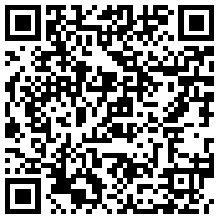

# jquery-weui-contacts 通讯录

> 由于 jquery-weui 本身没有提供常用通讯录的模块页面
> 所以这里自己整理一个简易通讯录，实现右侧字母快捷导航功能

## DEMO


## 技术实现点

### 右侧字母快捷导航布局

因为右侧的字母导航是垂直的排版，并且要撑满整个屏幕，所以在实现上用 `flex` 进行布局，同时设置 `flex-direction` 属性为垂直显示，最后设置 `justify-content` 属性为平均分布

```css
display: flex;
flex-direction: column;
justify-content: space-around;
```

### 移动端获取 `clientY` 值

移动端无法直接通过 `event.clientY` 获取到 `clientY` 值，需要使用以下方法获取

```js
// 原生 js 的 event 对象
event.changedTouches[0].clientY
// jquery 的 event 对象
event.originalEvent.changedTouches[0].clientY
```

### 如何实现定位

通过 `touch` 事件获取到 `clientY` 值，并通过 `clientY` 计算出位于字母导航的哪个字母上，再通过字母找到左侧联系人页面对应该字母的标题，最后计算出标题距离页面顶部的偏移值，并用 `scrollTop` 定位（具体实现看源码）